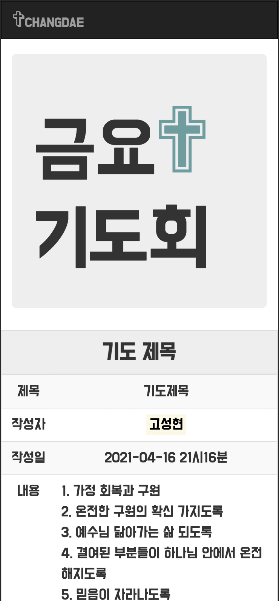
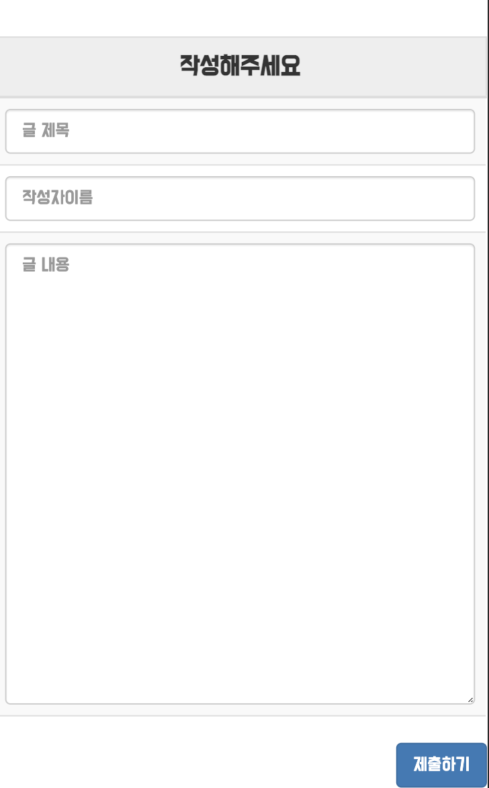
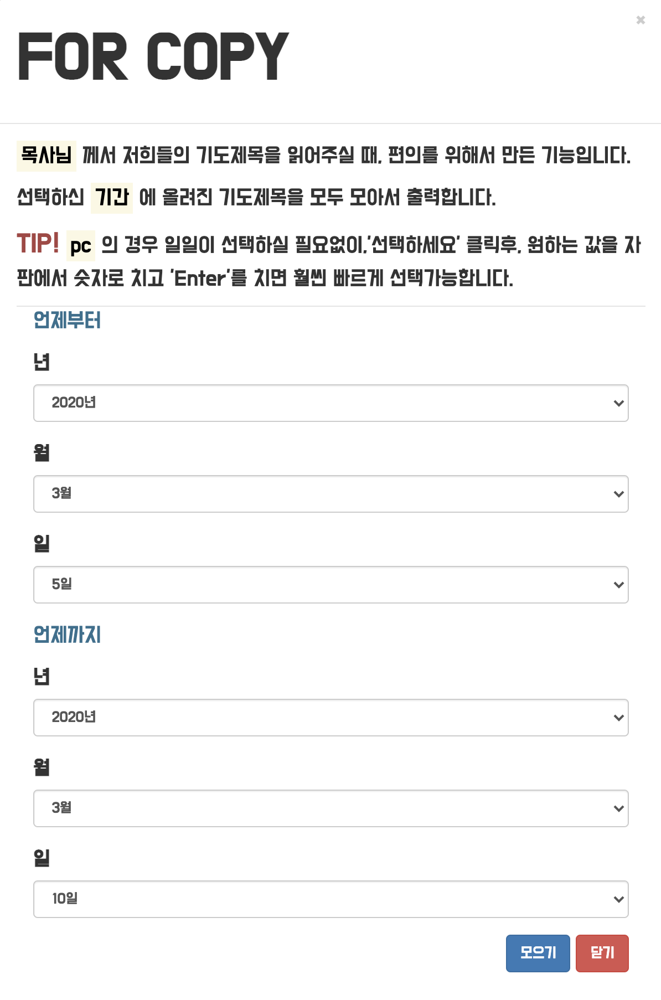
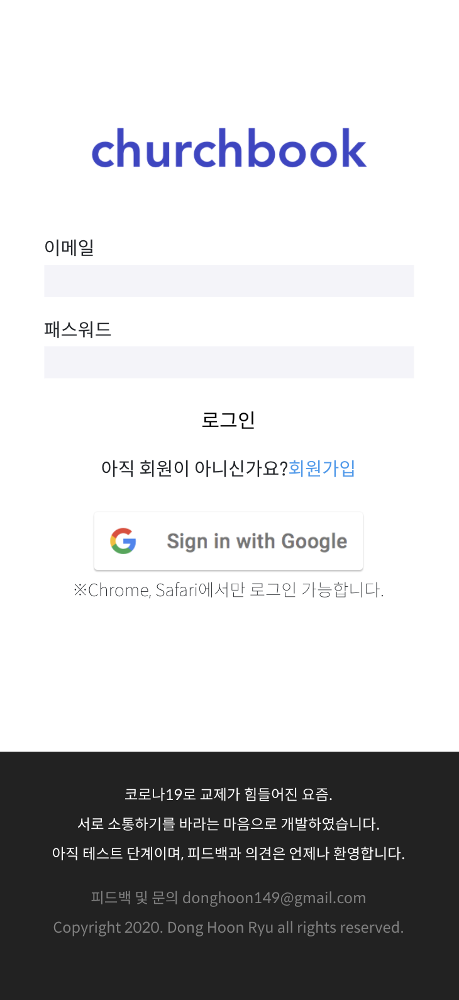
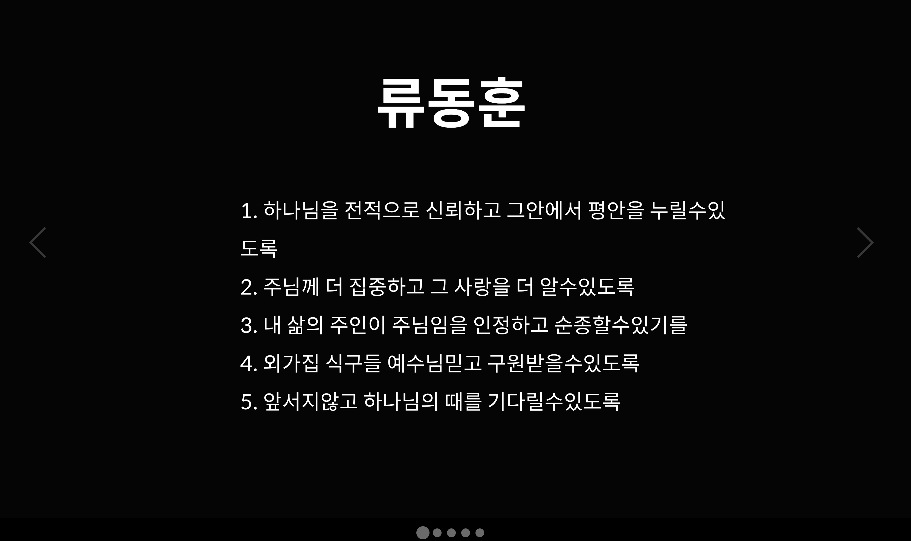

# 금요기도회 서비스 ( friday-prayer-meeting )

과거 2019년 초에 JSP로 구현했었던, '금요기도회' Ver2.0 프로젝트입니다.
다른 일들이 많아져 일단은 중지했지만, 추후에 다시 개발할 예정입니다.

## Ver 1.0

http://dong149.cafe24.com/ChangDae.jsp

2019년 1월부터 현재까지 계속해서 사용되고 있는 서비스입니다.
개발 지식이 전무하던 때에, 무작정 부딪히면서 개발했던 서비스입니다.
어설프지만 처음 개발했었고, 처음으로 유저가 생긴 서비스이며, 지금까지도 잘사용되고 있는 서비스이기에 남다른 애착이 있는 서비스입니다.

도메인도 따로 연결하지 않았고, Pagination도 없는 정말 날 것 그대로의 서비스이지만 개발의 궁극 목표가 무엇인지 고민하게 만들어주었고 서비스 개발에 흥미를 가져다 준 프로젝트입니다.

- java, jsp, mysql
- hosting : cafe24

## Problem

교회에는 아직까지도 많은 부분이 오프라인으로 진행되어 지고 있습니다. 
저는 저희 교회에서 행해지던 금요기도회에서 기도제목을 정리하고 모아서 기도를 할 때 일일이 수기로 작성한 것을 모아서 ppt에 옮겨 적고 그것을 나눠가져서 기도하는 과정에서 불필요한 시간과 노동이 많이 필요해지는 것에 주목했습니다.

 

## Feature

### 기도제목 CRUD 게시판

가장 기본이 되는 기능입니다. 글들을 작성, 수정, 삭제가 가능하게 구성하였습니다.

### 기도 제목 모아보기 기능

모든 사람들이 날짜를 기준으로 기도 제목을 모두 모아 확인할 수 있게 하였습니다.
가장 많이 사용되는 기능이고, 이 서비스를 만든 가장 핵심 이유라 할 수 있습니다.

## Ver 2.0

https://friday-prayer-meeting.firebaseapp.com/

따로 PPT를 만들지 않을 수 있도록 기도제목들이 바로 슬라이드쇼처럼 보일 수 있는 것을 핵심 기능이라 생각하고 개발하였습니다.

다른 교회도 모두 사용가능하게끔, 교회등록과 로그인 기능을 구현하였습니다.

2021년 안에 시간이 될 때, 추가로 개발할 예정입니다.

- firebase, react
